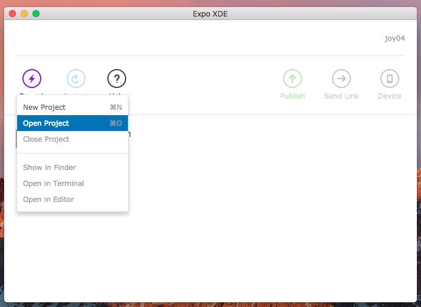
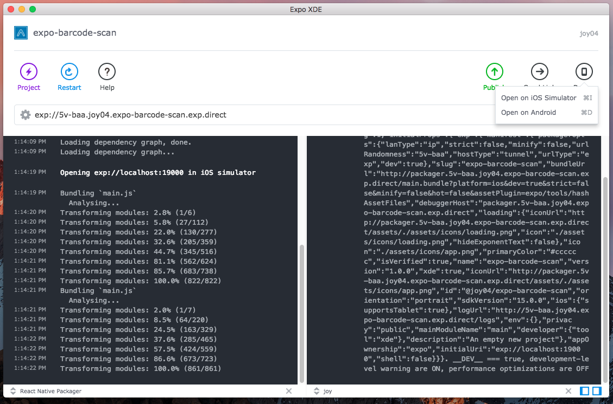

# expo-examples
Demo Expo Examples App using TDD

* Redux Counter Example 
* Redux To-D0 Example

## Clone Repo
------------
`https://github.com/joypatel04/expo-examples.git`

`yarn add or npm install`

## Installation setup of Expo XDE 
------------------------------

[Download Expo XDE for Mac/Windows](https://docs.expo.io/versions/v15.0.0/introduction/installation.html)

[Download Expo Clint App for iPhone](https://itunes.apple.com/us/app/expo-client/id982107779?mt=8) / [Download Expo Clint App for Android](https://play.google.com/store/apps/details?id=host.exp.exponent&hl=en)

## Run App from Expo XDE
-----------------------

XDE > Projets > Open Project

### Run App in Simulator

XDE > Device > iOS Simulator

### Run App in Device

XDE > Publish > Enter Phone number | Email

### Open Link in iPhone or Android